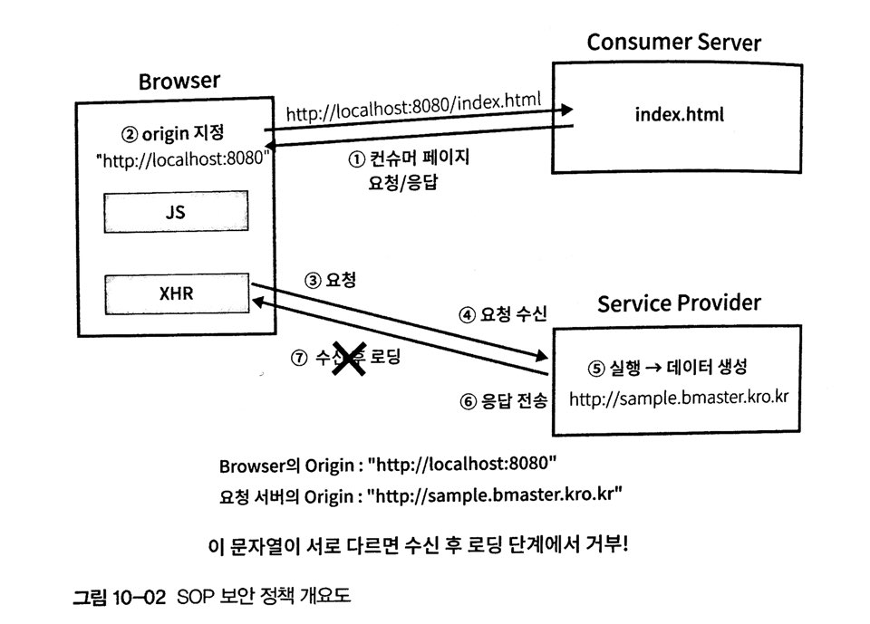

# 10. axios를 이용한 서버통신
서버통신을 하기 위한 라이브러리로 fetch, superagent, axios등이 있으며 vue.js 플러그인으로 개발된 vue-resource 라는 것도 있지만 가장 범용적이고 취소 기능을 지원하며 가장 인기있는 클라이언트 라이브러리인 axios를 사용하기를 권장합니다.

## 10.1 서비스 API 소개
로컬 API - (http://github.com/stepanowon/contactsvc)

데모 사이트 - (http://sample.bmaster.kro.kr/)

## 10.2 axios 기능테스트
axios 기능 테스트를 위해 vue create 명령어를 이용해 프로젝트를 생성합니다. 그리고 axios 라이브러리는 자동으로 설치되지 않으니 반드시 설치후 사용해야합니다.

1. 뷰 프로젝트를 생성합니다.
```
vue create contactsapp
```
2. 생성된 프로젝트 폴더로 접근합니다.
```
cd contactsapp
```
3. axios 모듈을 설치합니다.
```
yarn add axios 
npm istall --save axios
```

### 10.2.1 http 프록시 설정
브라우저에서 기본 설정된 보안 정책 중에 SOP(Same Origin Policy)라는 것이 있습니다.



HTML문서에서 다른 외부 서버와 통신하려는 경우, 즉 현재 브라우저의 Origin과 다른 Origin에 해당하는 서버와 통신하려고 할 때 요청부터 응답 전송까지는 정상적으로 수행되지만 브라우저로 로딩하는 단계에서 오류가 발생하게 됩니다.

이 문제를 흔히들 크로스 도메인(Cross Domain) 문제라고 불러왔지만 정확한 의미는 SOP 보안 정책으로 인해 크로스 오리진으로 부터 데이터를 로드할수 없는 현상이라고 말할수 있습니다.

이 문제를 해결하기 위한 방법으로 다음과 같은 방법이있습니다.
- 컨슈머 서버 (Consumer Server) 측에 프록시 요소 생성
- 서비스 제공자 (Service Provider) 측에서 CORS(Cross Origin Resource Sharing) 기능을 제공
- 서비스 제공자 (Service Provider) 측에서 JSONP(JSON Padding) 기능을 제공

외부 API 서비스를 우리가 개발한 애플리케이션에서 이용하는 경우 3가지 해결 방법중 하나를 선택해야 합니다. 외부 API 서비스가 CORS나 JSONP와 같은 기법을 제공한다면 프론트앤드 개발자는 아무런 조치를 취하지 않아도 서비스를 이용할수 있습니다. 하지만 두가지 기능을 제공하지 않는다면 컨슈머 서버에 프록시 요소를 생성해서 컨슈머를 거쳐 요청히 전달 되도록 해야합니다.

`
프록시? -  클라이언트가 자신을 통해서 다른 네트워크 서비스에 간접적으로 접속할 수 있게 해 주는 컴퓨터 시스템이나 응용 프로그램을 가리킨다. 서버와 클라이언트 사이에 중계기로서 대리로 통신을 수행하는 것을 가리켜 '프록시', 그 중계 기능을 하는 것을 프록시 서버라고 부른다.
`


생성한 프로젝트에서 웹팩 설정 파일에서 설정 한 후 웹팩 개발 서버를 이용해 프록시 서버 기능을 이용할 수 있습니다. 

프로젝트 최상위 디렉터리에 vue.config.js 파일을 생성하고 다음과 같이 작성합니다.

`
vue.config.js는 vue-cli로 생성한 프로젝트에서 웹팩에 대한 기본 설정을 추가, 변경을 할수 있는 기능을 제공하는 파일입니다. 
`

설정 내용(http://cli.vuejs.org/config)

```javascript
module.exports = {
    devServer: {
        proxy: {
            '/api': {
                target: 'http://localhost:3000',
                ws: true,
                changeOrigin: true,
                pathRewrite: {
                    '^/api' : ''
                }
            }
        }
    }
}
```

개발용 서버에서 /api/contacts로 요청하면 http://localhost:3000/contacts로 요청을 전달합니다. /api 경로로의 요청을 target으로 전달하는것입니다.

로컬 PC에서 실행하지 않았다면 target을 http://sample.bmaster.kro.kr로 지정하세요.

>CORS에 대한 내용
(https://developer.mozilla.org/ko/docs/Web/HTTP/Access_control_CORS)

### 10.2.2 axios 사용
Vue CLI 도구를 이용하여 axios 라이브러리를 사용하는경우 npm , yarn 패키지를 이용합니다.
```
yarn add axios 
npm istall --save axios
```

1~6장 예제와 같이 단일 HTML 파일로 작성하는 경우 CDN 방식을 사용합니다.
```html
<script src="https://unpkg.com/axios/dist/axios.min.js"></script>
```

1. 저수준 API  
    - axios(config)  
    - axios(url, config)
2. 각 메소드별 별칭
    - axios.get(url[, config])
    - axios.delete(url[, config])
    - axios.post(url[, data[, config]])
    - axios.put(url[, data[, config]])
    - axios.head(url[, config])
    - axios.options(url[, config])

미리 생성한 프로젝트의 src 디렉터리 아래 AppAxiosTest.vue 파일을 추가하고 기본틀을 작성합니다.

```html
<!-- 예제 10-2 : src/AppAxiosTest.vue -->
<template>
    <div id="app">
        <div class="container">
            <div class="form-group">
                <button @click="fetchContacts">1페이지 연락처 조회</button>
            </div>
            <div  class="form-group">
                <input type="text" v-model="name" placeholder="이름을 입력합니다" />
                <input type="text" v-model="tel" placeholder="전화번호를 입력합니다" />
                <input type="text" v-model="address" placeholder="주소를 입력합니다" />
                <button @click="addContact">연락처 1건  추가</button>
            </div>
            <div  class="form-group">
                <input type="text" v-model="no" /> <button @click="fetchContactOne">연락처 1건  조회</button>
            </div>
            <div  class="form-group">
                <input type="text" v-model="no" />
                <input type="text" v-model="name" placeholder="이름을 입력합니다" />
                <input type="text" v-model="tel" placeholder="전화번호를 입력합니다" />
                <input type="text" v-model="address" placeholder="주소를 입력합니다" />
                <button @click="updateContact">수정</button>
            </div>
            <div class="form-group">
                <input type="text" v-model="no" /> <button @click="deleteContact">삭제</button>
            </div>
            <div class="form-group">
                <input type="text" v-model="no" />
                <input type="file" ref="photofile" name="photo" /> 
                <button @click="changePhoto">파일 변경</button>
            </div>
        </div>
        <span>JSON 출력</span>
        <div id="result" class="container">
            <xmp>{{result}}</xmp>
        </div>
    </div>
</template>

<script>
export default {
    name : "app",
    data() {
        return {
            no : 0, name : '', tel:'', address:'',
            result : null
        }
    },
    methods : {
        fetchContacts : function() {
            
        },
        addContact : function() {
            
        },
        fetchContactOne : function() {
            
        },
        updateContact : function() {
            
        },
        deleteContact : function() {
            
        },
        changePhoto : function() {
            
        }
    }
}
</script>

<style>
@import url("https://cdn.bootcss.com/bootstrap/3.3.5/css/bootstrap.css");
#app {
  font-family: 'Avenir', Helvetica, Arial, sans-serif;
  -webkit-font-smoothing: antialiased;
  -moz-osx-font-smoothing: grayscale;
  text-align: center;
  color: #2c3e50;
  margin-top: 60px;
}
.container { border:solid 1px gray; padding:10px; margin-bottom:10px; text-align:left; }
#result { text-align: left ; padding:20px; border:solid 1px black; }
.form-group { border:dashed 1px gray; padding:5px 5px 5px 20px; }
</style>
```
App.vue 대신에 AppAxiosTest.vue를 일시적으로 사용하도록 아래와 같이 main.js를 수정합니다.
```javascript
//예제 10-03 : src/main.js 변경
import Vue from 'vue'
//import App from './App.vue'
import App from './AppAxiosTest.vue'
import axios from 'axios'

Vue.config.productionTip = false

new Vue({
  render: h => h(App)
}).$mount('#app')
```

### 10.2.3 axios 요청 방법
fetchContacts 메서드 내부에 삽입합니다.
```javascript
//예제 10-4 : axios 저수준 메서드
axios({
    method : 'GET',
    url : '/api/contacts',
    params : { pageno : 1, pagesize:5 }
})
.then((response) => {
    console.log(response);
    this.result = response.data;
})
.catch((ex)=> {
    console.log("ERROR!!!! : ", ex);
})
```
axios 저수준 메서드는 여러가지 옵션이 있지만 method, url, params 등의 간단한 정보만을 전달하여 GET /api/contacts?pageno=1&pagesize5와 같은 요청을 처리합니다.  
axios API 호출 후 리턴 되는 객체는 Promise 객체입니다. 요청이 성공하면 then이 호출되며, 요청이 실패하면 catch가 호출됩니다.

별칭 메서드 get을 이용하면 다음과 같습니다.
```javascript
//예제 10-5 : axios.get 메서드
axios.get('/api/contacts', {
    params : { pageno : 1, pagesize:5 }
})
.then((response) => {
    console.log(response);
    this.result = response.data;
})
.catch((ex)=> {
    console.log("ERROR!!!! : ", ex);
})
```

한 건의 연락처를 조회하는 fetchContactOne 메서드를 작성합니다.
```javascript
//예제 10-6 : fetchContactOne 메서드
axios.get('/api/contacts/'+this.no)
.then((response) => {
    console.log(response);
    this.result = response.data;
})
```

### 10.2.4 응답 형식
Promise 객체의 then 메서드 내부에서는 함수 파라미터인 응답(response) 객체는 다양한 정보를 포함하고 있습니다.    

우선 가장 중요한 수신 데이터는 data 속성을 통해서 확인할 수 있습니다.
- config: 요청 시에 사용된 config 옵션 정보입니다.
- headers: 응답 헤더 정보입니다.
- request: 서버와 통신 시에 사용된 XMLHttpRequest 객체 정보입니다.
- status: HTTP 상태 코드 (HTTP Status Code)
- statusText: 서버 상태를 나타내는 문자열 정보입니다.

이중에서 기본적으로 확인해야 하는 정보는 HTTP 상태 코드입니다.

- 2XX : 성공
- 3XX : 리다이렉션
- 4XX : 요청 오류(클라이언트 측 오류)
- 5XX : 서버오류

(https://ko.wikipedia.org/wiki/HTTP_%EC%83%81%ED%83%9C_%EC%BD%94%EB%93%9C)

### 10.2.5 기타 메서드
POST 메서드 - POST 메서드 에서는 주로 axios.post(url, data, config) 형태를 주로 사용합니다.
간단한 예로 addContact 내부에 다음 코드를 작성합니다.
```javascript
//예제 10-7 : axios.post 메서드
axios.post('/api/contacts', { name:this.name, tel:this.tel, address:this.address })
.then((response) => {
    console.log(response);
    this.result = response.data;
    this.no = response.data.no;
})
.catch((ex)=> {
    console.log("ERROR!!!! : ", ex);
})
```
PUT 메서드 - 사용 방법은 POST와 유사합니다. updateContact 메서드 내부에 다음 코드를 작성합니다.
```javascript
//예제 10-8 : axios.put 메서드
axios.put('/api/contacts/'+this.no, { name:this.name, tel:this.tel, address:this.address })
.then((response) => {
    console.log(response);
    this.name = '';
    this.tel = '';
    this.address='';
    this.result = response.data;
})
.catch((ex)=> {
    console.log("ERROR!!!! : ", ex);
})
```
DELETE 메서드 - 삭제를 위해서 사용합니다. GET 메서드와 용법이 비슷합니다.
deleteContact 메서드 내부에 다음 코드를 작성합니다.
```javascript
//예제 10-9 : axios.delete 메서드
axios.delete('/api/contacts/'+this.no)
.then((response) => {
    console.log(response);
    this.no = 0;
    this.result = response.data;
})
.catch((ex)=> {
    console.log("ERROR!!!! : ", ex);
})
```

### 10.2.6 파일 업로드 처리
파일 업로드 기능도 axios로 구현할 수 있습니다. 
```html
<form method="post"
    enctype="multipart/form-data" action="/contact/1491586656774/photo">
    <input type="file" name="photo" />
    <input type="submit" />
</form>
```
axios를 이용해서 파일 업로드 기능을 구현하기 위해서 <input type="file" ... /> 필드를 ref라는 옵션을 사용하여 직접 참조해야합니다. 
```html
<input type="file" ref="photofile" name="photo" />
```

이제 ref 옵션을 이용하여 changePhoto 메서드 내부에 코드를 작성합니다.
```javascript
var data = new FormData();
var file = this.$refs.photofile.files[0];
data.append('photo', file);
axios.post('/api/contacts/' +this.no + '/photo', data)
.then((response) => {
    this.result = response.data;
})
.catch((ex) => {
    console.log('updatePhoto failed', ex);
});
```
FormData 객체를 생성하고 this.$ref.photofile과 같이 ref 옵션을 이용해 파일 필드를 직접 참조합니다. 이 필드의 값을 FormData 객체에 추가한 뒤 서버로 요청하면 됩니다.

### 10.2.7 axios 요청과 config 옵션
axios를 요청할 때 params 옵션 외에 다양한 유형의 옵션을 이용할 수 있습니다.

- baseURL: 이 옵션을 이용해 공통적인 URL의 앞 부분을 미리 등록해두면 요청 시 나머지 부분만을 요청 URL로 전달하면 됩니다. 가능하다면 axios.defaults.baseURL 값을 미리 바꾸는 편이 좋습니다.
- transformRequest: 요청 데이터를 서버로 전송하기 전에 데이터를 변환하기 위한 함수를 등록합니다.
- transformResponse: 응답 데이터를 수신한 직후에 데이터를 변환하기 위한 함수를 등록합니다.
- headers: 요청 시에 서버로 전달하고자 하는 HTTP 헤더 정보를 설정합니다.

### 10.2.8 Vue 인스턴스에서 axios 이용하기
Vue 인스턴스 내부에서 axios를 이용하기 위해 Vue.prototype에 axios를 추가하면 더욱 간단한게 사용할수 있습니다.

```javascript 
//예제 10-11 : src/main.js 변경
import Vue from 'vue'
//import App from './App.vue'
import App from './AppAxiosTest.vue'
import axios from 'axios'

Vue.prototype.$axios = axios;
Vue.config.productionTip = false

new Vue({
  render: h => h(App)
}).$mount('#app')
```
이제 Vue 인스턴스 내부에서는 axios를 import하지 않고도 this.$axios를 사용할 수 있습니다.
```javascript
//예제 10-12 : fetchContactOne 메서드 변경
this.$axios.get('/api/contacts/'+this.no)
.then((response) => {
    console.log(response);
    this.result = response.data;
})
```

### 10.2.9 axios 사용 시 주의사항
axios를 사용하면서 then()를 처리할 때는 ES6의 **화살표 함수(Arrow Function)를 
사용할 것을 권장**합니다.  

이유는 데이터를 수신한 후에 Vue 인스턴스 내부의 데이터를 변경해야 하는 경우가 많은데 데이터 옵션을 엑세스 하기 위해서는 this 객체가 Vue 인스턴스를 참조할 수 있어야 합니다. then() 내부에서 화살표 함수를 사용하지 않으면 this가 Vue 인스턴스를 참조하지 않기 때문에 밖에서 별도의 변수에 this를 할당한 후에 클로저(Closure) 방식으로 접근해야 하는 불편함이 발생합니다.

```javascript
// 화살표 함수를 사용한 경우
this.$axios.get('/api/contacts/'+this.no)
.then((response) => {
    console.log(response);
    this.result = response.data;
})
// 화살표 함수를 사용하지 않은 경우
var vm = this;
this.$axios.get('/api/contacts/'+this.no)
.then(function(response){
    console.log(response);
    vm.result = response.data;
})
```

then() 내부의 코드를 화살표 함수로 작성하면 바깥 영역의 this를 전달받아 사용할수 있습니다. 하지만 이부분을 이전 방식의 함수로 작성하면 this를 사용할 수 없습니다. 그렇기 때문에 바깥 영역에서 this를 별도의 변수의 저장해주어야만 그 변수로 Vue 인스턴스에 접근할 수 있게 됩니다.

두가지 사용방법을 모두 사용 할 수 있지만 화살표 함수를 사용하는 편이 this를 직접 이용 할 수 있기 때문에 더 편리해 보입니다.

## 10.3 연락처 애플리케이션 예제
연락처 앱 예제를 만들어 봅니다.
### 10.3.1 기초 작업
App.vue 대신에 AppAxiosTest.vue를 사용하도록 설정했습니다. 이것을 다시 App.vue를 참조하도록 변경합니다. 또한 axios를 Vue.prototype에 추가합니다.
```javascript
//예제 10-13 : src/main.js 변경
import Vue from 'vue'
import App from './App.vue'
//import App from './AppAxiosTest.vue'
import axios from 'axios'

Vue.prototype.$axios = axios;
Vue.config.productionTip = false

new Vue({
  render: h => h(App)
}).$mount('#app')
```

axios를 이용해 접근할 URL을 미리 상수로 정의합니다. 이렇게 상수로 정의하면 URL이 변경되더라도 신속하게 유지보수할 수 있습니다.  
src/ 아래에 Config.js 파일을 추가하고 다음과 같이 작성합니다.
```javascript
var BASE_URL = "/api";

export default {
    PAGESIZE : 5,
    
    //전체 연락처 데이터 요청(페이징 포함)
    FETCH : BASE_URL + "/contacts",
    //연락처 추가
    ADD : BASE_URL + "/contacts",
    //연락처 업데이트
    UPDATE : BASE_URL + "/contacts/${no}",
    //연락처 한건 조회
    FETCH_ONE : BASE_URL + "/contacts/${no}",
    //연락처 삭제
    DELETE : BASE_URL + "/contacts/${no}",
    //연락처 사진 업로드->변경
    UPDATE_PHOTO : BASE_URL + "/contacts/${no}/photo"
}
```

src/ 아래에 EventBus.js 파일을 추가하고 다음과 같이 작성합니다.
```javascript
import Vue from 'vue';

var vm = new Vue({
    name : "EventBus"
});

export default vm;
```

src/components 디렉터리에 다음 5개의 컴포넌트 파일을 생성합니다.
| 컴포넌트 | 필요 데이터 |
|:--------|:--------|
| App.vue | currentView: 동적 컴포넌트로 보여줄 컴포넌트로 지정 |
| ContactList.vue | contactlist: 연락처 목록 데이터 |
| AddContact.vue |  |
| UpdateContact.vue | contact: 연락처 한건 데이터 |
| ContactForm.vue | mode: 쓰기/수정 (add, update) |
| UpdatePhoto.vue | contact: 연락처 한건 데이터 |

페이지네이션을 구현하기 위해 vuejs-pagainate라는 패키지를 추가합니다.
```
yarn add vuejs-paginate@1.9.3 bootstrap@3.3.7
npm install --save vuejs-paginate@1.9.3 bootstrap@3.3.7
```
IE에서는 기본적으로 Promise 객체를 지원하지 않습니다. axios 는 Promise 기반이기때문에 IE에서 사용할수 있도록 하려면 추가적인 polyfill 요소를 다운로드합니다.
```
yarn add es6-promise
npm install --save es6-promise
```
bootstrap와 es6-promise 를 import합니다.
```javascript
//예제 10-13 : src/main.js 변경
import Vue from 'vue'
import App from './App.vue'
//import App from './AppAxiosTest.vue'
import axios from 'axios'
import 'bootstrap/dist/css/bootstrap.css'
import ES6Promise from 'es6-promise'
ES6Promise.polyfill()

Vue.prototype.$axios = axios;
Vue.config.productionTip = false

new Vue({
  render: h => h(App)
}).$mount('#app')
```
