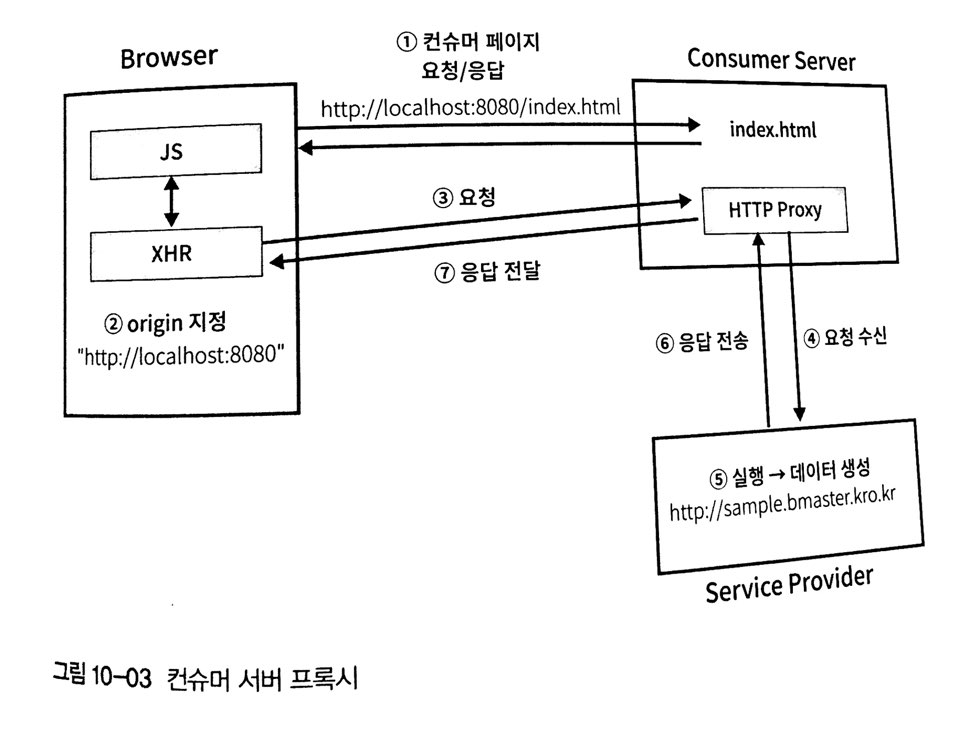

# 10. axios를 이용한 서버통신
- 서버통신을 하기 위한 라이브러리로 fetch, superagent, axios등이 있으며 vue.js 플러그인으로 개발된 vue-resource 라는 것도 있지만 가장 범용적이고 취소 기능을 지원하며 가장 인기있는 클라이언트 라이브러리인 axios를 사용하기를 권장합니다.

## 10.1 서비스 API 소개
로컬 API - (http://github.com/stepanowon/contactsvc)

데모 사이트 - (http://sample.bmaster.kro.kr/)

## 10.2 axios 기능테스트
axios 기능 테스트를 위해 vue create 명령어를 이용해 프로젝트를 생성합니다. 그리고 axios 라이브러리는 자동으로 설치되지 않으니 반드시 설치후 사용해야합니다.

1. 뷰 프로젝트를 생성합니다.
```
vue create contactsapp
```
2. 생성된 프로젝트 폴더로 접근합니다.
```
cd contactsapp
```
3. axios 모듈을 설치합니다.
```
yarn add axios 
npm istall --save axios
```

### 10.2.1 http 프록시 설정
브라우저에서 기본 설정된 보안 정책 중에 SOP(Same Origin Policy)라는 것이 있습니다.


HTML문서에서 다른 외부 서버와 통신하려는 경우, 즉 현재 브라우저의 Origin과 다른 Origin에 해당하는 서버와 통신하려고 할 때 요청부터 응답 전송까지는 정상적으로 수행되지만 브라우저로 로딩하는 단계에서 오류가 발생하게 됩니다.

이 문제를 흔히들 크로스 도메인(Cross Domain) 문제라고 불러왔지만 정확한 의미는 SOP 보안 정책으로 인해 크로스 오리진으로 부터 데이터를 로드할수 없는 현상이라고 말할수 있습니다.

이 문제를 해결하기 위한 방법으로 다음과 같은 방법이있습니다.
- 컨슈머 서버 (Consumer Server) 측에 프록시 요소 생성
- 서비스 제공자 (Service Provider) 측에서 CORS(Cross Origin Resource Sharing) 기능을 제공
- 서비스 제공자 (Service Provider) 측에서 JSONP(JSON Padding) 기능을 제공

외부 API 서비스를 우리가 개발한 애플리케이션에서 이용하는 경우 3가지 해결 방법중 하나를 선택해야 합니다. 외부 API 서비스가 CORS나 JSONP와 같은 기법을 제공한다면 프론트앤드 개발자는 아무런 조치를 취하지 않아도 서비스를 이용할수 있습니다. 하지만 두가지 기능을 제공하지 않는다면 컨슈머 서버에 프록시 요소를 생성해서 컨슈머를 거쳐 요청히 전달 되도록 해야합니다.

`
프록시? -  클라이언트가 자신을 통해서 다른 네트워크 서비스에 간접적으로 접속할 수 있게 해 주는 컴퓨터 시스템이나 응용 프로그램을 가리킨다. 서버와 클라이언트 사이에 중계기로서 대리로 통신을 수행하는 것을 가리켜 '프록시', 그 중계 기능을 하는 것을 프록시 서버라고 부른다.
`



생성한 프로젝트에서 웹팩 설정 파일에서 설정 한 후 웹팩 개발 서버를 이용해 프록시 서버 기능을 이용할 수 있습니다. 

프로젝트 최상위 디렉터리에 vue.config.js 파일을 생성하고 다음과 같이 작성합니다.

`
vue.config.js는 vue-cli로 생성한 프로젝트에서 웹팩에 대한 기본 설정을 추가, 변경을 할수 있는 기능을 제공하는 파일입니다. 
`

설정 내용(http://cli.vuejs.org/config)

```javascript
module.exports = {
    devServer: {
        proxy: {
            '/api': {
                target: 'http://localhost:3000',
                ws: true,
                changeOrigin: true,
                pathRewrite: {
                    '^/api' : ''
                }
            }
        }
    }
}
```

개발용 서버에서 /api/contacts로 요청하면 http://localhost:3000/contacts로 요청을 전달합니다. /api 경로로의 요청을 target으로 전달하는것입니다.

로컬 PC에서 실행하지 않았다면 target을 http://sample.bmaster.kro.kr로 지정하세요.

>CORS에 대한 내용
(https://developer.mozilla.org/ko/docs/Web/HTTP/Access_control_CORS)

### 10.2.2 axios 사용
Vue CLI 도구를 이용하여 axios 라이브러리를 사용하는경우 npm , yarn 패키지를 이용합니다.
```
yarn add axios 
npm istall --save axios
```

1~6장 예제와 같이 단일 HTML 파일로 작성하는 경우 CDN 방식을 사용합니다.
```html
<script src="https://unpkg.com/axios/dist/axios.min.js"></script>
```

1. 저수준 API  
    - axios(config)  
    - axios(url, config)
2. 각 메소드별 별칭
    - axios.get(url[, config])
    - axios.delete(url[, config])
    - axios.post(url[, data[, config]])
    - axios.put(url[, data[, config]])
    - axios.head(url[, config])
    - axios.options(url[, config])

미리 생성한 프로젝트의 src 디렉터리 아래 AppAxiosTest.vue 파일을 추가하고 기본틀을 작성합니다.

```html
<!-- 예제 10-2 : src/AppAxiosTest.vue -->
<template>
    <div id="app">
        <div class="container">
            <div class="form-group">
                <button @click="fetchContacts">1페이지 연락처 조회</button>
            </div>
            <div  class="form-group">
                <input type="text" v-model="name" placeholder="이름을 입력합니다" />
                <input type="text" v-model="tel" placeholder="전화번호를 입력합니다" />
                <input type="text" v-model="address" placeholder="주소를 입력합니다" />
                <button @click="addContact">연락처 1건  추가</button>
            </div>
            <div  class="form-group">
                <input type="text" v-model="no" /> <button @click="fetchContactOne">연락처 1건  조회</button>
            </div>
            <div  class="form-group">
                <input type="text" v-model="no" />
                <input type="text" v-model="name" placeholder="이름을 입력합니다" />
                <input type="text" v-model="tel" placeholder="전화번호를 입력합니다" />
                <input type="text" v-model="address" placeholder="주소를 입력합니다" />
                <button @click="updateContact">수정</button>
            </div>
            <div class="form-group">
                <input type="text" v-model="no" /> <button @click="deleteContact">삭제</button>
            </div>
            <div class="form-group">
                <input type="text" v-model="no" />
                <input type="file" ref="photofile" name="photo" /> 
                <button @click="changePhoto">파일 변경</button>
            </div>
        </div>
        <span>JSON 출력</span>
        <div id="result" class="container">
            <xmp>{{result}}</xmp>
        </div>
    </div>
</template>

<script>
export default {
    name : "app",
    data() {
        return {
            no : 0, name : '', tel:'', address:'',
            result : null
        }
    },
    methods : {
        fetchContacts : function() {
            
        },
        addContact : function() {
            
        },
        fetchContactOne : function() {
            
        },
        updateContact : function() {
            
        },
        deleteContact : function() {
            
        },
        changePhoto : function() {
            
        }
    }
}
</script>

<style>
@import url("https://cdn.bootcss.com/bootstrap/3.3.5/css/bootstrap.css");
#app {
  font-family: 'Avenir', Helvetica, Arial, sans-serif;
  -webkit-font-smoothing: antialiased;
  -moz-osx-font-smoothing: grayscale;
  text-align: center;
  color: #2c3e50;
  margin-top: 60px;
}
.container { border:solid 1px gray; padding:10px; margin-bottom:10px; text-align:left; }
#result { text-align: left ; padding:20px; border:solid 1px black; }
.form-group { border:dashed 1px gray; padding:5px 5px 5px 20px; }
</style>
```
App.vue 대신에 AppAxiosTest.vue를 일시적으로 사용하도록 아래와 같이 main.js를 수정합니다.
```javascript
//예제 10-03 : src/main.js 변경
import Vue from 'vue'
//import App from './App.vue'
import App from './AppAxiosTest.vue'
import axios from 'axios'

Vue.prototype.$axios = axios;
Vue.config.productionTip = false

new Vue({
  render: h => h(App)
}).$mount('#app')

```

### 10.2.3 axios 요청 방법